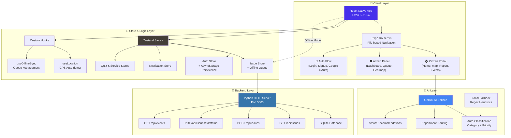

<div align="center">

# 🌐 LocalPulse

### *Your Ward. Your Voice. Real Change.*

[](https://expo.dev)
[](https://reactnative.dev)
[](https://www.typescriptlang.org)
[](https://python.org)
[](LICENSE)

<br/>

**LocalPulse** is a hyper-local civic engagement platform that empowers citizens to report infrastructure issues, track resolution progress in real-time, and collaborate with their municipal ward administration — all from a single, beautiful mobile app.

> 🏙️ *Think of it as a "311 for India" — purpose-built for ward-level governance with AI-powered triage, gamification, and offline-first resilience.*

<br/>

[📱 Download APK](https://drive.google.com/file/d/1kPmaw9PA_Leyvp7nnSw-YAzcfZGeedc6/view?usp=drivesdk) · [📧 Contact](#-support)

</div>

---

## ✨ Features

<table>
<tr>
<td width="50%">

### 🏠 Citizen Portal
- **📸 Report Issues** — Snap photos with camera or gallery, auto-detect location via GPS, and submit civic complaints (potholes, garbage, water logging, etc.)
- **🗺️ Interactive Ward Map** — SVG-based offline map with issue pins, category filters, and tap-to-view details
- **🔍 Smart Search** — Search issues by keyword, category, or status across your entire ward
- **📊 Live Feed** — Real-time issue feed with trending/recent sorting, radius-based filtering (1–10 km), and category chips
- **👍 Upvote & Comment** — Community-driven prioritization with upvotes and threaded comments
- **📅 Community Events** — Discover and RSVP to ward meetings, cleanup drives, and awareness campaigns

</td>
<td width="50%">

### 🛡️ Admin Dashboard
- **📈 Analytics Overview** — Total issues, open/in-progress/resolved counts, resolution rates, and average response times
- **📋 Issue Queue** — Manage and triage incoming reports with status transitions (Open → Under Review → In Progress → Resolved)
- **🔥 Heatmap View** — Visual ward-level hotspot detection for infrastructure problem areas
- **🏘️ Ward Reports** — Drill-down reports per ward with department-wise breakdowns
- **🔧 Service Queue** — Manage local service provider listings and verification

</td>
</tr>
<tr>
<td colspan="2">

### 🚀 Platform Capabilities
| Feature | Description |
|---|---|
| 🤖 **AI-Powered Triage** | Gemini AI auto-classifies issues by category, priority, and department assignment |
| 🎮 **Gamification (XP System)** | Earn XP and level up for reporting, upvoting, and attending events |
| 📶 **Offline-First Architecture** | Full offline queue with automatic sync when connectivity returns |
| 🔐 **Google Sign-In** | One-tap authentication via Google OAuth alongside email/password |
| 💾 **Persistent Sessions** | AsyncStorage-backed sessions that survive app restarts on mobile |
| 🧠 **Civic Quiz Module** | Educational quizzes on governance, rights, and civic awareness |
| 🛠️ **Local Services Directory** | Find verified plumbers, electricians, tutors, and more in your ward |
| 🔔 **Push Notifications** | Real-time alerts for status changes, new nearby issues, and events |
| 🌐 **Cross-Platform** | Runs on Android, iOS, and Web from a single codebase |

</td>
</tr>
</table>

---

## 🛠️ Tech Stack

<div align="center">

| Layer | Technology | Purpose |
|:---:|:---:|:---|
| **Frontend** |  | Cross-platform mobile UI |
| **Framework** |  | Managed workflow, OTA updates, native APIs |
| **Language** |  | Type-safe frontend code |
| **Navigation** |  | File-based routing with nested layouts |
| **State** |  | Lightweight global state management |
| **Forms** |  | Performant form handling with Zod validation |
| **Styling** |  | Utility-first + native styling |
| **Animations** |  | 60fps gesture-driven animations |
| **AI** |  | Issue classification & smart triage |
| **Backend** |  | RESTful API with SQLite |
| **Database** |  | Lightweight relational storage |
| **Storage** |  | Persistent mobile session & offline data |
| **Build** |  | Cloud-based APK/AAB generation |

</div>

---

## 📡 API Reference

The backend runs a Python HTTP server on **port 5000**. All endpoints return JSON.

### Issues

| Method | Endpoint | Description | Query Params |
|:---:|:---|:---|:---|
| `GET` | `/api/issues` | Fetch all issues with optional filters | `status`, `category`, `radius`, `lat`, `lon` |
| `POST` | `/api/issues` | Create a new civic issue report | — |
| `POST` | `/api/issues/:id/upvote` | Upvote an issue | — |
| `POST` | `/api/issues/:id/comments` | Add a comment to an issue | — |
| `PUT` | `/api/issues/:id/status` | Update issue status (Admin) | — |

### Events

| Method | Endpoint | Description |
|:---:|:---|:---|
| `GET` | `/api/events` | Fetch all community events |

### Request & Response Examples

<details>
<summary><b>POST /api/issues</b> — Create Issue</summary>

```json
// Request Body
{
  "title": "Large pothole near Gandhi Square",
  "description": "Deep pothole causing accidents near the main intersection",
  "category": "Pothole",
  "latitude": 22.7196,
  "longitude": 75.8577,
  "reporter_id": "uuid-string",
  "is_anonymous": false,
  "image_urls": ["https://example.com/pothole.jpg"]
}

// Response — 201 Created
{
  "id": "generated-uuid",
  "title": "Large pothole near Gandhi Square",
  "status": "open",
  "priority": "high",
  "created_at": "2026-06-27T10:30:00Z"
}
```

</details>

<details>
<summary><b>PUT /api/issues/:id/status</b> — Update Status (Admin)</summary>

```json
// Request Body
{
  "status": "in_progress",
  "changed_by": "admin-uuid",
  "comment": "Repair crew dispatched"
}

// Response — 200 OK
{
  "id": "issue-uuid",
  "status": "in_progress",
  "updated_at": "2026-06-27T12:00:00Z"
}
```

</details>

---

## 🏗️ Architecture & Pipeline



### Data Flow Pipeline

```
┌──────────────┐    ┌───────────────┐    ┌──────────────┐    ┌───────────────┐
│   📸 Citizen  │───▶│  🤖 AI Triage  │───▶│  📡 Backend   │───▶│  🗄️ Database   │
│  Reports Issue│    │ (Gemini/Local) │    │ (Python HTTP) │    │  (SQLite)     │
│  + Photo/GPS  │    │ Category+Dept  │    │ REST API      │    │  10 Tables    │
└──────────────┘    └───────────────┘    └──────────────┘    └───────────────┘
        │                                                            │
        │              ┌───────────────┐    ┌──────────────┐         │
        └──────────────│  📶 Offline    │◀───│  🔔 Notifs    │◀────────┘
                       │  Sync Queue   │    │  + Status Δ  │
                       └───────────────┘    └──────────────┘
```

---

## 📂 Folder Structure

```
LocalPulse/
├── 📱 app/                          # Expo Router — Screen Files
│   ├── _layout.tsx                  # Root layout with auth guard
│   ├── index.tsx                    # Entry redirect
│   ├── (auth)/                      # 🔐 Authentication Flow
│   │   ├── splash.tsx               #   Splash / loading screen
│   │   ├── onboarding.tsx           #   First-time onboarding
│   │   ├── login.tsx                #   Login (Email + Google)
│   │   └── signup.tsx               #   Registration
│   ├── (citizen)/                   # 🏠 Citizen Tab Navigator
│   │   ├── _layout.tsx              #   Tab bar configuration
│   │   ├── home.tsx                 #   Issue feed with filters
│   │   ├── map.tsx                  #   Interactive ward map
│   │   ├── create.tsx               #   Report new issue
│   │   ├── events.tsx               #   Community events
│   │   ├── services.tsx             #   Local service providers
│   │   ├── profile.tsx              #   User profile & XP
│   │   ├── search.tsx               #   Search issues
│   │   ├── learn.tsx                #   Civic education hub
│   │   └── notifications.tsx        #   Notification center
│   ├── (admin)/                     # 🛡️ Admin Panel
│   │   ├── _layout.tsx              #   Admin drawer/tab config
│   │   ├── dashboard.tsx            #   Analytics overview
│   │   ├── issue-queue.tsx          #   Issue management queue
│   │   ├── heatmap.tsx              #   Ward issue heatmap
│   │   ├── ward-detail.tsx          #   Per-ward drill-down
│   │   └── service-queue.tsx        #   Service provider mgmt
│   ├── issue/                       # 📋 Issue Detail
│   └── quiz/                        # 🧠 Quiz Module
│
├── 🧩 components/                   # Reusable UI Components
│   ├── AppHeader.tsx                #   Global header (logo, XP, network)
│   ├── ScreenWrapper.tsx            #   SafeArea + keyboard wrapper
│   ├── IssueCard.tsx                #   Issue card (feed item)
│   ├── OfflineBanner.tsx            #   Offline mode indicator
│   └── SkeletonLoader.tsx           #   Loading placeholder
│
├── 📦 store/                        # Zustand State Stores
│   ├── useAuthStore.ts              #   Auth state + AsyncStorage persistence
│   ├── useIssueStore.ts             #   Issues CRUD + offline queue
│   ├── useDraftStore.ts             #   Draft reports (auto-save)
│   ├── useNotificationStore.ts      #   Notification management
│   ├── useQuizStore.ts              #   Quiz progress & scoring
│   ├── useServiceStore.ts           #   Service providers data
│   ├── useSyncStore.ts              #   Sync queue tracking
│   └── seedIssues.ts                #   Mock data for development
│
├── 🪝 hooks/                        # Custom React Hooks
│   ├── useLocation.ts               #   GPS location tracking
│   └── useOfflineSync.ts            #   Offline queue management
│
├── 🤖 services/                     # External Service Integrations
│   └── gemini.ts                    #   Gemini AI classification + fallback
│
├── ⚙️ server/                       # Python Backend
│   ├── server.py                    #   HTTP REST API server
│   ├── db.py                        #   Database initialization & queries
│   └── verify.py                    #   Data verification utilities
│
├── 🗄️ db/                           # Database Layer
│   ├── schema.sql                   #   PostgreSQL/SQLite schema (10 tables)
│   ├── seed.sql                     #   Sample seed data
│   └── localpulse.db                #   SQLite database file
│
├── 🎨 assets/                       # Static Assets
│   ├── icon.png                     #   App icon
│   ├── adaptive-icon.png            #   Android adaptive icon
│   ├── splash.png                   #   Splash screen image
│   └── favicon.png                  #   Web favicon
│
├── 📄 app.json                      # Expo configuration
├── 📄 eas.json                      # EAS Build profiles
├── 📄 babel.config.js               # Babel + Reanimated plugin
├── 📄 tailwind.config.js            # NativeWind configuration
├── 📄 tsconfig.json                 # TypeScript configuration
└── 📄 package.json                  # Dependencies & scripts
```

---

## 💡 How Is This Useful?

<table>
<tr>
<td width="33%" align="center">

### 👨‍👩‍👧‍👦 For Citizens
Report potholes, garbage dumps, broken streetlights, and water logging with just a photo and a tap. Track your complaint in real-time and see when the repair crew is dispatched.

</td>
<td width="33%" align="center">

### 🏛️ For Municipal Admins
Prioritize and route incoming complaints with AI-powered triage. Monitor ward-level heatmaps to identify chronic problem areas. Measure KPIs like average response time and resolution rate.

</td>
<td width="33%" align="center">

### 🎓 For Communities
Build civic awareness through quizzes and educational content. Organize community events like cleanup drives and townhall meetings. Create a transparent bridge between citizens and governance.

</td>
</tr>
</table>

### Real-World Impact

- ⚡ **Faster Response** — AI auto-routes issues to the correct department, cutting response time
- 📍 **Hyper-Local** — Ward-level granularity ensures issues reach the right local authority
- 📶 **Works Everywhere** — Offline-first design means it works even in low-connectivity areas
- 🎮 **Engaging** — Gamification (XP, levels, badges) incentivizes sustained civic participation
- 🔍 **Transparent** — Full issue lifecycle tracking with status history and public comments

---

## 🚀 How to Run Locally

### Prerequisites

| Tool | Version | Download |
|:---|:---|:---|
| Node.js | v18+ | [nodejs.org](https://nodejs.org) |
| Python | 3.8+ | [python.org](https://python.org) |
| Expo Go (Mobile) | Latest | [Play Store](https://play.google.com/store/apps/details?id=host.exp.exponent) / [App Store](https://apps.apple.com/app/expo-go/id982107779) |
| Git | Latest | [git-scm.com](https://git-scm.com) |

### Step 1 — Clone the Repository

```bash
git clone https://github.com/Niladri13072004/LocalPulse.git
cd LocalPulse
```

### Step 2 — Install Dependencies

```bash
npm install
```

### Step 3 — Start the Backend Server

Open a **new terminal** and run:

```bash
cd server
python server.py
```

> The API server will start at `http://localhost:5000`

### Step 4 — Start the Expo Dev Server

Back in the **project root**:

```bash
# For LAN access (recommended for mobile testing)
npx expo start --lan

# For web browser
npx expo start --web

# For tunnel (if LAN doesn't work)
npx expo start --tunnel
```

### Step 5 — Open the App

| Platform | How to Open |
|:---|:---|
| **Android** | Open **Expo Go** → Scan the QR code shown in your terminal |
| **iOS** | Open **Camera** → Scan the QR code → Opens in Expo Go |
| **Web** | Press `w` in the terminal or visit `http://localhost:8081` |

### Step 6 — (Optional) Build APK

```bash
# Install EAS CLI
npm install -g eas-cli

# Login to Expo account
eas login

# Build Android APK
eas build --platform android --profile preview
```

### 🔑 Environment Variables (Optional)

Create a `.env` file in the project root for AI features:

```env
EXPO_PUBLIC_GEMINI_API_KEY=your_gemini_api_key_here
EXPO_PUBLIC_OPENROUTER_API_KEY=your_openrouter_key_here
```

> **Note:** The app works perfectly without API keys — it falls back to a local regex-based classifier for issue triage.

---

## 📊 Database Schema

The app uses **10 normalized tables** designed with PostGIS spatial support:

| Table | Description |
|:---|:---|
| `wards` | Geographic ward boundaries with PostGIS polygons |
| `users` | Citizen & admin profiles with XP and badges |
| `departments` | Municipal departments for issue routing |
| `issues` | Civic reports with GPS coordinates and status tracking |
| `issue_votes` | Community upvote tracking |
| `issue_comments` | Threaded discussion on issues |
| `issue_status_history` | Full audit trail of status transitions |
| `events` | Community events with RSVP tracking |
| `service_providers` | Local service directory with verification |
| `notifications` | Push notification records |

---

## 📱 Demo Credentials

| Role | Email | Password |
|:---:|:---|:---|
| 🧑‍💼 Citizen | `citizen@localpulse.com` | `password123` |
| 🛡️ Admin | `admin@localpulse.com` | `admin123` |

---

## 🤝 Support

Having trouble? Have a feature request? Want to contribute?

<div align="center">

📧 **Email:** [singhaniladri2004@gmail.com](mailto:singhaniladri2004@gmail.com)

🐛 **Bug Reports:** [Open an Issue](https://github.com/Niladri13072004/LocalPulse/issues)

💬 **Discussions:** [GitHub Discussions](https://github.com/Niladri13072004/LocalPulse/discussions)

</div>

---

<div align="center">

### ⭐ Star this repo if LocalPulse inspires you to build for civic good!

Made with ❤️ by [Niladri Singha](https://github.com/Niladri13072004)

</div>
